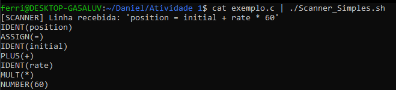
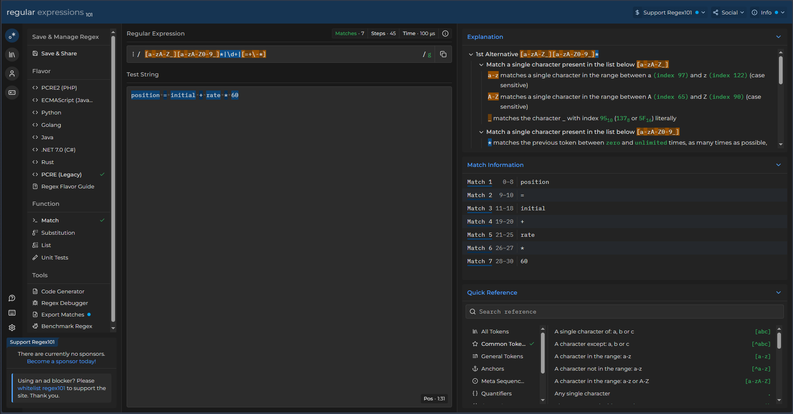
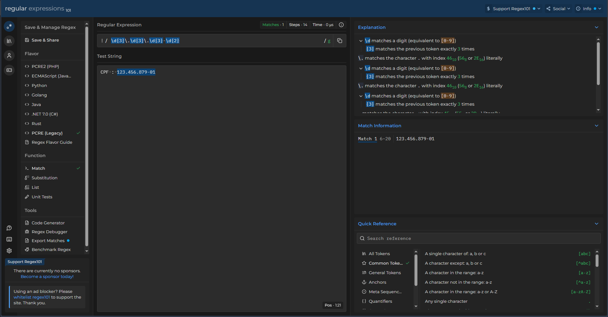
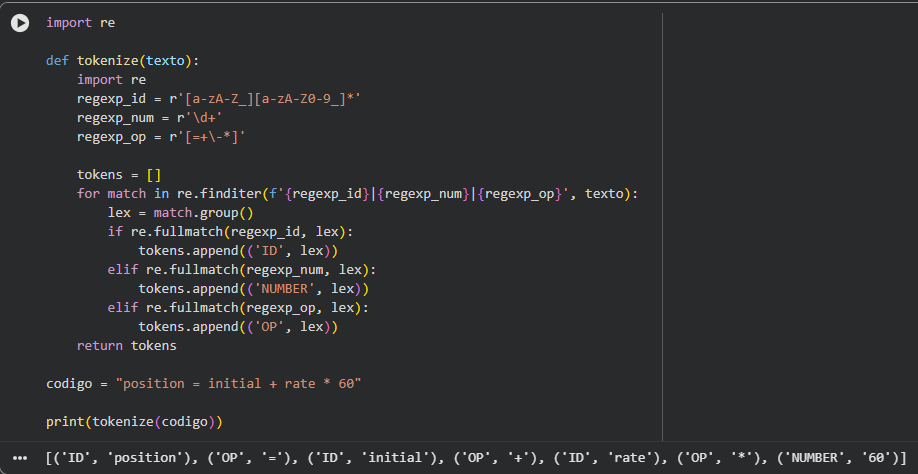

# LAB 1 – Scanner, Analisador Léxico, Regexp e Autômato Finito

**Faculdade:** PUC-SP  
**Curso:** Ciência da Computação  
**Disciplina:** Compiladores    
- Lucas Ferri dos Santos  

---

## 📌 Sobre o Laboratório

Este repositório contém as entregas referentes ao LAB 1, voltadas à compreensão e implementação da primeira fase de um compilador: o **Analisador Léxico (Scanner)**.  
As atividades exploram desde o conceito de **fluxo de caracteres** até a construção de um **mini-scanner estruturado** e a utilização de expressões regulares para tokenização.

---

## 💻 Atividades Realizadas

### Atividade 1: Bash no Terminal Linux (Simulando o "fluxo de entrada")

- Criamos um script Bash (`scanner_simples.sh`) executado via terminal, que lê um arquivo de código fonte (`exemplo.c`) linha a linha.
- O script utiliza o comando `tr` (ou leitura direta) para tratar o fluxo de caracteres, simulando como o compilador enxerga o **character stream** antes da tokenização.
- Tokens identificados: identificadores, números, operadores e símbolos desconhecidos.

**Evidência:**  


---

### Atividade 2: Expressões Regulares (Regex)

- Utilizamos a ferramenta online [Regex101](https://regex101.com/) para modelar expressões regulares capazes de identificar os tokens de uma linguagem simples.

#### Regex Unificada

```regex
[a-zA-Z_][a-zA-Z0-9_]*|\d+|[=+\-*]
```

**Evidencia:**


**Extras**
expressões regulares para validar dados reais:

CPF: ```\d{3}\.\d{3}\.\d{3}-\d{2}```

Telefone (Brasil): ``` \(\d{2}\)\s\d{4,5}-\d{4}```

E-mail: ```[a-zA-Z0-9._%+-]+@[a-zA-Z0-9.-]+\.[a-zA-Z]{2,}```



## Atividade 4 – RegExp em Python e Java

###  Objetivo

Implementar um mini-analisador léxico (scanner) utilizando expressões regulares, demonstrando na prática como um autômato finito reconhece padrões em um fluxo de caracteres e os transforma em tokens.

---

##  Implementação em Python

Foi desenvolvido um mini-scanner utilizando a biblioteca `re`, responsável por identificar padrões no código de entrada.

###  Expressão regular utilizada

```
[a-zA-Z_][a-zA-Z0-9_]|\d+|[=+-]
```

Essa expressão representa o autômato finito, sendo capaz de reconhecer:

- Identificadores (`ID`)
- Números inteiros (`NUMBER`)
- Operadores (`OP`)

---

###  Funcionamento

A função `tokenize(texto)` percorre o código utilizando `re.finditer`, identificando os lexemas e classificando-os em seus respectivos tipos.



## Atividade 6 – OpenAI Tokenizer × Tokens de Compilador

### Comparação dos Tokens

Foi utilizada a seguinte expressão:

```
position = initial + rate * 60
```

### Tokens do compilador (analisador léxico):
```
IDENT(position)
ASSIGN(=)
IDENT(initial)
PLUS(+)
IDENT(rate)
MULT(*)
NUMBER(60)
```
#### Tokens do tokenizer da OpenAI:
```
pos
ition

initial
+
rate
*
60
```
---

### Por que o tokenizer da OpenAI quebra "position"?

O tokenizer da OpenAI utiliza o método **Byte Pair Encoding (BPE)**, que divide palavras em partes menores com base na frequência em grandes volumes de texto.

Assim, a palavra:
```
position → pos + ition
```

é separada dessa forma porque essas partes aparecem com frequência em outros contextos.

---

###  Diferença Conceitual

#### Token Léxico (Compilador)

- Baseado em regras formais (expressões regulares)
- Segue a gramática da linguagem
- É determinístico e preciso
- Cada token tem significado sintático

---

#### Token de LLM (OpenAI)

- Baseado em estatística (BPE)
- Não segue gramática formal
- Focado em eficiência e compressão de texto
- Tokens podem não ter significado isolado

###  Discussão Final

O analisador léxico de um compilador precisa ser extremamente preciso, pois qualquer erro pode comprometer toda a compilação do programa. Ele segue regras rígidas definidas pela gramática da linguagem.

Já o tokenizer da OpenAI não precisa dessa precisão, pois seu objetivo é processar linguagem natural de forma eficiente. Ele trabalha com probabilidades e padrões, priorizando contexto em vez de exatidão sintática.

---

###  Conclusão

O scanner de um compilador e o tokenizer de um modelo de linguagem possuem objetivos diferentes. Enquanto o compilador exige precisão absoluta para interpretar corretamente o código, o tokenizer baseado em BPE busca eficiência no processamento de texto, mesmo que isso implique dividir palavras em partes sem significado independente.
